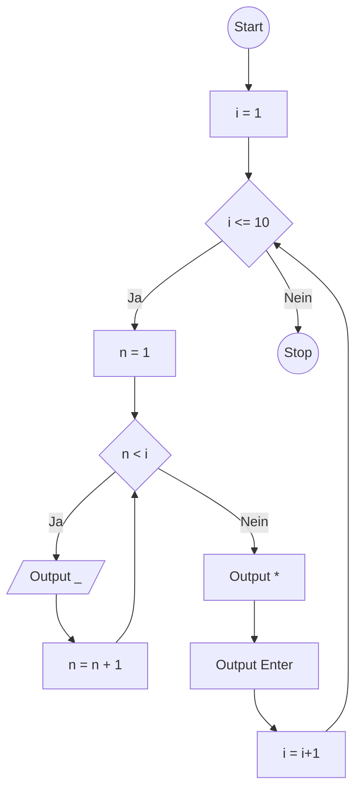

# this is a new header
ah can we see, you belong to me.

```mermaid
flowchart TD
    A((Start)) --> B[i = 1]
    B --> C{i <= 10}
    C -->|Ja| D[n = 1]
    C -->|Nein| E((Stop))
    D --> F{n < i}
    F-->|Ja| G[/Output _/] 
    G --> J[n = n + 1] --> F
    F -->|Nein| H[Output *] --> I[Output Enter] --> K[i = i+1] -->C
```
